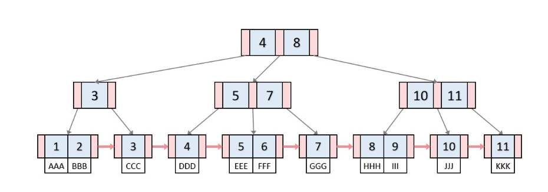
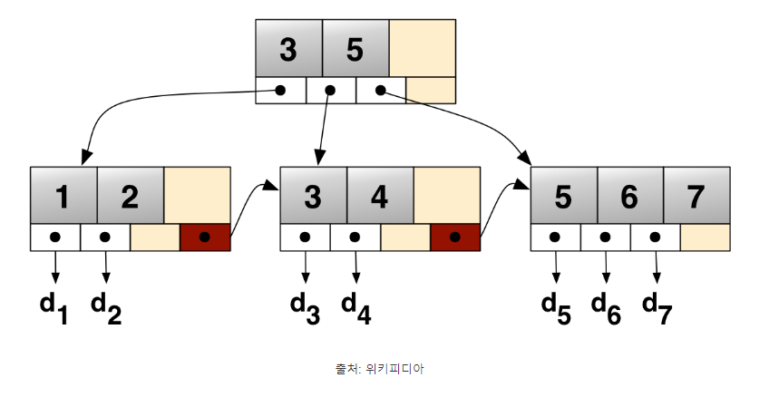
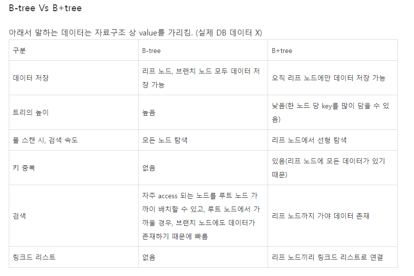

# B-tree & B+tree

## B-tree

1. 규칙
    - 노드 안에 k개의 데이터가 있으면 자식 노드 수는 k+1
    - 노드 안 데이터 정렬
    - 자식 노드의 데이터는 부모 노드의 데이터에 따라 배치
    - 루트 노드가 리프 노드가 아닌 경우 2개 이상의 자식을 가짐
    - M차 B-tree라면 루트 노드와 리프 노드 제외 M/2개 이상의 데이터 가지고 있어야 함.  
    **M차 B-tree** : 노드가 가질 수 있는 최대 자식의 수가 M
    - 모든 리프 노드의 높이는 같아야 함.
    - 리프 노드의 데이터 수는 M보다 작아야 함.
2. 연산
    - 탐색 : 루트노드에서 하향식    
    - 삽입 : 리프노드에서 상향식, B-tree 조건 중 하나인 **리프 노드의 데이터 수는 M보다 작아야 한다** 만족 시키는 것에 주의
    - 삭제 : 
        - **루트 노드가 리프 노드가 아닌 경우 2개 이상의 자식을 가짐**
        - **각 노드의 데이터는 M/2 ~ M-1개의 데이터를 가져야 함**
        - **노드 안에 k개의 데이터가 있으면 자식 노드 수는 k+1**  
       3가지를 모두 만족시키는 데에 유의하며 작업
3. 특징
    - 검색 연산에 효과적
    - 각 내부 노드는 여러 키를 가지며, 각 키는 서브 트리를 가리킴
    - 모든 리프 노드가 동일한 깊이에 위치하도록 균형 맞춤(균형 트리)
    - 테이블 갱신이 비효율적(INSERT/UPDATE/DELETE)
    - 트리의 높이 = 탐색 시간
    - 키와 데이터 모두 내부 노드에 저장  
    - 데이터 양에 비례해 효과 상승
        - 풀 스캔 : 일반 전체 검사
        - 인덱스 스캔 : 트리구조에서 데이터 찾는 것  
        
        
그림 출처 : https://velog.io/@emplam27/%EC%9E%90%EB%A3%8C%EA%B5%AC%EC%A1%B0-%EA%B7%B8%EB%A6%BC%EC%9C%BC%EB%A1%9C-%EC%95%8C%EC%95%84%EB%B3%B4%EB%8A%94-B-Plus-Tree

## B+tree

1. 원리
    - B-tree의 확장 개념
    - 노드의 키가 정렬된 상태 유지
    - 리프 노드의 연결 리스트가 정렬된 순서
    - 리프 노드는 오름차순으로 연결
    - 모든 키는 리프 노드에서만 나타남
    - 내부 노드의 키는 리프 노드의 가장 오른쪽 자식을 가리킴
2. 특징
    - 내부 노드는 키만 존재
    - 리프 노드에 키, 데이터가 존재
    - 검색 연산에 효과적
    - 범위 검색에는 B-tree보다 더 효과적
    - 인덱스 노드 : leaf node가 아닌 자료
    - 데이터 노드 : leaf node 자료

### B-tree vs B+tree

## B*tree
1. 원리
    - B*트리는 B+트리의 분할과 병합 알고리즘을 따름
    - 노드의 키들은 정렬 상ㅌ애 유지
    - B+트리는 내부 노드를 항상 최소한으로 채우지만, B트리는 내부 노드를 더 채워 노드 차수 유지에 사용
2. 특징
    - B+트리의 확장판
    - 내부 노드는 키만 저장, 리프 노드는 키와 데이터 저장
    - 연결리스트로 구성
    - B*트리는 B+트리보다 큰 노드 차수를 가지며 이로 인해 더 큰 브랜치 팩터를 가짐
