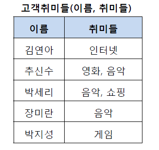
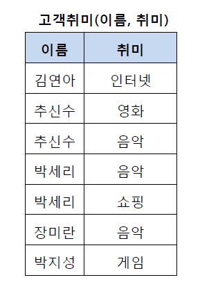
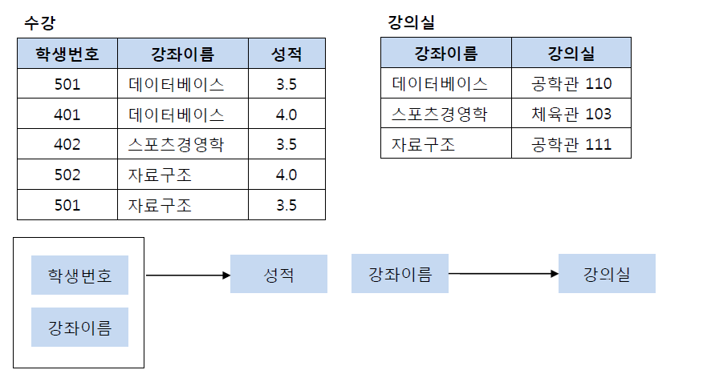

# RDB & NoSQL에서의 클러스터링/레플리케이션 방식

## RDB(Relational DataBase)
- 관계형 데이터베이스로, 엑셀 시트처럼 빈칸에 내용을 쌓아가는 데어티방식을 뜻함 
- 일반적인 서비스에서 가장 많이 사용되는 DB타입
- 미리 타입을 정해두고 그에 따라 데이터를 쌓기 때문에, 복잡한 계산 없이 효율적인 DB 설계가 가능

### RDB 특징
1. 테이블 구조
    - 데이터를 행과 열의 형태로 테이블에 저장
2. 관계성
    - 어러 테이블 간 relation을 이용해 데이터를 효율적으로 관리
    - primary key, foreign key를 사용하여 정의
3. 정규화  
    - 제1정규화(1NF)
        - 테이블의 column이 원자값(Atomic Value)를 갖도록 테이블을 분해하는 것  
        - ex) 제1 정규화 전  
          
        - ex) 제1 정규화 후  
          
    - 제2정규화(2NF)
        - 제1 정규화를 진행한 테이블에 대해 완전 함수 종속을 만족하도록 테이블을 분해하는 것
        - **완전 함수 종속** : 기본키의 부분집합이 결정자가 되어서는 안되는 것을 의미
        - ex) 제2 정규화 잘못된 예시  
        
        - ex) 올바른 예시   
        
    - 제3정규화(3NF)
        - 제2 정규화를 진행한 테이블에 대해 이행 종속 없애도록 분해하는 것
        - **이행적 종속** : A->B, B-> C 성립 시 A-> C가 성립되는 것  
        - ex) 제3 정규화 전  
          
        - ex) 제3 정규화 후  
          
    - BCNF(Boyce-Codd Normal Form)
        - 제3 정규화 만족 + 모든 결정자가 후보키 집합에 속해야 함.
        - ex) BCNF 전  
        
        - ex) BCNF 후
        
    - 제4정규화이상~
        - BCNF에서 더 나아간 정규화.
        - 이 이상은 잘 진행하지 않음.
4. 데이터 무결성
    - 주요 키, 외래 키, 제약 조건 등을 사용해 데이터의 정확성 유지
5. SQL (Structured Query Language)
    - 데이터베이스와 상호 작용을 위해 SQL 사용
    - SQL 언어는 다른 RDB에서도 사용 가능하기 때문에 비관계성 DB에 비해 편리
6. 트랜잭션 관리
    - ACID(Atomicity, Consistency, Isolation, Duarability) : 원자성, 일관성, 고립성, 지속성 보장    

### RDB 종류
- 오라클 RDB (세계 1위)
    - 규모가 크고 대용량 설비에 적합
    - UNIX, Linux 등 여러 OS에서 호환성이 좋은 편
- MySQL (세계 2위)
    - 오라클이 배포하는 오픈 소스 기반의 RDB
    - 오픈 소스이기에 비용이 저렴
- 마이크로소프트 MSSQL   (세계 3위)
    - 윈도우 기반 RDB
    - 오프라인 서버 구축 시 Linux, Unix 기반 서버에 비해 가격 대비 성능이 떨어짐
    - Linux, Unix 서버에서 호환성이 안 좋음
- IBM DB2
    - 과거 하드웨어 강자인 IBM이 만든 RDB
    - 규모가 큰 서비스에 적합
    - 오프라인 서버 구축 시 운영체제가 제한
    - 다른 서비스에 비해 성능이 떨어진다는 평이 지배적

정규화 images  출처 : https://mangkyu.tistory.com/110

## NoSQL
- 비관계형 데이터베이스로 RDB보다 덜 제한적인 **일관성 모델**을 이용하는 데이터 저장 및 검색 메커니즘

### NoSQL의 특징
#### 장점
1. Schema Flexibility(스키마의 유연성)
    - 스키마 고정 x 이거나 더 유연
    - 데이터 모델 변경에 쉽게 대응 가능
2. Distributed and Scalable(분산 처리 및 확장성)    
    - 대부분 분산 DB 설계되어 있어 데이터 저장과 처리를 여러 노드에 분산 가능
    - 수평 확장 가능, 새로운 노드 추가로 시스템 성능 향상 가능
3. High Availability (높은 가용성)    
    - 아키텍쳐 분산으로 장애가 발생해도 DB 가용성 유지 가능
#### 단점
1. Lack of Consistency(일관성 부족)
    - CAP(Consistency, Availability, Partitions Tolerance) 이론에서 선택한 일관성, 가용성, 분할 용량 중 두 가지만을 선택할 수 있음.    
2. Limited Query Language 
    - SQL과 같이 공통된 강력한 쿼리 언어 X, 기능 부족
    - 복잡한 조인 및 트랜잭션 기능 제한 
3. Complex Data Modeling (복잡한 데이터 모델링)
    - 다양한 데이터 모델 지원 -> 데이터 모델 설계 및 구현이 어려움
    - 스키마가 유연 -> 데이터 모델링이 어려움        
### NoSQL 종류
- Key-Value DB
    - Key와 Value의 쌍으로 데이터가 저장되는 유형.
    - Amazon의 Dynamo Paper에서 유래
    - 제품 : Riak, Vodemort, Tokyo...
- Wide Column DB
    - Big Table DB라고도 함
    - Google의 BigTable Paper에서 유래
    - Column Family 데이터 모델 사용
    - 제품 : HBase, Cassandra, Hypertable...
- Document Stores DB
    - 문서 지향 데이터베이스
    - JSON 또는 BSON과 같은 문서 형식으로 데이터를 저장
    - 제품 : MongoDB, CouchDB, Elasticsearch...
- Graph DB
    - 노드와 간선으로 이루어진 그래프 형식으로 데이터 저장, 관계 중시
    - 제품 : Neo4j, Amazon Neptune, ArangoDB...
- Multi-Model DB
    - 다양한 데이터 모델을 지원하는 DB
    - 제품 : ArangoDB, OrientDB...
- Time Series DB
    - 시간에 따른 데이터 포인트 저장하고 쿼리하는데 사용하는 DB
    - 제품 : InfluxDB, OpenTSDB, TimescaleDB...    

## RDB Clustering vs NoSQL Sharding/Replication

### RDB Clustering
#### Index Clustering
- 여러 테이블이 클러스터된 인덱스를 공유하는 방식
- 데이터가 클러스터된 Index에 따라 물리적으로 저장 되어 있음
- 해당 인덱스의 키 순서대로 데이터에 엑세스할 때 성능 향상
- 다만 삽입, 갱신, 삭제가 더 복잡해질 가능성 有  
#### Table Clustering 
- 여러 테이블이 클러스터된 테이블로 묶이는 방식
- 동일한 클러스터에 속하는 테이블은 공통의 클터스터 키를 가짐
- 키 기반 데이터의 효율적인 조회

### NoSQL
#### Sharding(샤딩)
- NoSQL은 DB속 대량의 데이터를 여러 노드로 분산하여 저장(샤딩)
- 각 노드는 특정 범위의 데이터 담당
- 전체 데이터에 대한 부하 분산과 확장성 구현
#### Replication(레플리케이션)
- 데이터를 여러 노드에 복제하는 것
- 각 노드는 동일한 데이터를 가지고 있음, 이를 통해 장애가 발생할 경우에도 데이터 손실 방지
- **RDB에서는 Master-Slave 아키텍쳐 사용하여 레플리케이션 구현**
