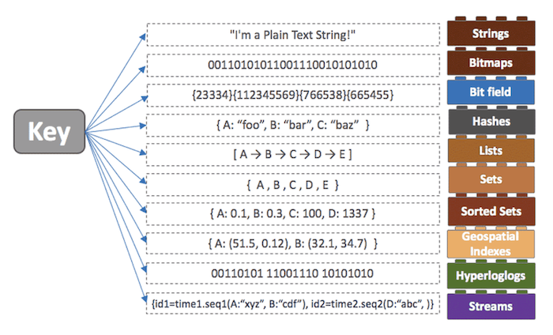
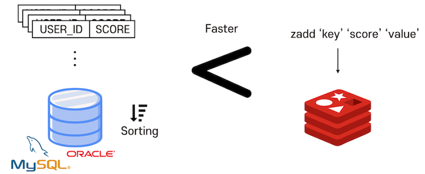

# Redis

## Redis란

- Remote Dictionary Server의 약자로서, “키-값” 구조의 비정형 데이터를 관리하기 위한 오픈 소스 기반의 비관계형(NoSQL) 인메모리 DBMS. 
- DB, cache, message broker 등 의 용도로 사용. 
> message broker
Publisher(송신자)로부터 전달 받은 메시지를 Subscriber(수신자)로 전달해주는 중간 역할이며 응용 소프트웨어 간에 메시지를 교환할 수 있게 한다. 이때 Redis를 Message Queue로 활용.
> 

## 특징

- Key, Value 구조이기 때문에 쿼리를 사용할 필요 없음
- `다양한 자료 구조` : String, Lists, Sets, Sorted, Hashes 등 지원

- `인메모리 데이터베이스` : 데이터를 디스크에 쓰는 구조가 아니라 메모리에서 데이터를 처리하기 때문에 속도가 빠름

- Single Threaded : 한 번에 하나의 명령만 처리할 수 있음. 중간에 처리 시간이 긴 명령어가 들어오면 그 뒤에 명령어들은 모두 앞에 명령어가 처리될 때까지 대기 필요.

> `String`: 가장 일반적인 key - value 구조의 형태 
`Sets`: String의 집합. 여러 개의 값을 하나의 value에 넣을 수 있음. 
`Sorted Sets`: 중복된 데이터를 담지 않는 Set 구조에 정렬 Sort를 적용한 구조 
`Lists`: Array 형식의 데이터 구조. List를 사용하면 처음과 끝에 데이터를 넣고 빼는 건 빠르지만 중간에 데이터를 삽입하거나 삭제하는 것은 어려움.
> 

### Redis의 영속성

지속성 보장을 위해 데이터를 disk에 저장할 수 있음. 서버가 내려가더라도 disk에 저장된 데이터를 읽어서 메모리에 로딩함.

- RDB(Snapshotting) 방식
    - 순간적으로 메모리에 있는 내용을 disk에 전체를 옮겨 담는 방식
- AOF (Append On File) 방식
    - Redis의 모든 write/update 연산 자체를 모두 log파일에 기록하는 형태. 입력/수정/삭제 명령이 실행될 때 마다 기록. 조회 명령은 제외.

## Redis 이용

- look aside cache (Lazy Loading)
1. Cache에 Data 존재 유무 확인
2. Data 가 있다면 cache의 Data 사용
3. Data 가 없다면 cache의 실제 DB Data 사용
4. DB에서 가져온 Date를 Cache에 저장
- write back
1. Data를 Cache에 저장
2. Cache에 있는 Data를 일정 기간동안 Check
3. 모여있는 Data를 DB에 저장
4. Cache에 있는 Data 삭제

## Cache Server

캐시를 이용하게 될 경우 데이터 정합성 문제가 발생할 수 있다.

> 데이터 정합성 : 어느 한 데이터가 캐시와 데이터베이스에서 서로 정보값이 다른 현상
> 

따라서 적절한 캐시 읽기 전략과 캐시 쓰기 전략이 필요하다.

### cache

요청할 결과를 미리 저장해둔 후 빠르게 서비스 해주는 것.  
미리 결과를 저장하고 나중에 요청이 오면 그 요청에 대해서 **DB또는 API를 참조하지 않고** `cache에 접근`하여 요청을 처리함.

### 캐시 읽기 전략

1. Look Aside 패턴
2. Read Through 패턴
	- 캐시에서만 데이터를 읽어오는 전략
	- Look Aside와 비슷하지만 데이터 동기화를 라이브러리 또는 캐시 제공자에게 위임하는 방식
	- 데이터를 조회하는데 있어 전체적으로 속도가 느림
	- 데이터 조회를 전적으로 캐시에만 의존하므로, redis가 다운될 경우 서비스 이용에 차질이 생길 수 있음.
	- 캐시와 DB간의 데이터 동기화가 항상 이루어져 데이터 정합성 문제에서 벗어날수 있음.
	- 읽기가 많은 곳에 적합

### 캐시 쓰기 전략

1. Write Back 패턴
2. Write Through 패턴
 -  데이터베이스와 Cache에 동시에 데이터를 저장하는 전략
 -  DB 동기화 작업 캐시에게 위임
 -  DB와 캐시가 항상 동기화 되어 있어, 캐시 데이터 항상 최신 상태 유지
 -  데이터 유실이 발생하면 안되는 상황에 적합
 -  매 요청마다 두번의 write가 발생하게 됨으로써 빈번한 생성, 수정이 발생하는 서비스에는 성능 이슈 발생
3. Write Around 패턴
 -  Write Through보다 훨씬 빠름
 -  모든 데이터는 DB에 저장 (캐시를 갱신하지 않음)
 -  Cache miss 가 발생하는 경우에만 DB와 캐시에도 데이터를 저장
 -  캐시와 DB내의 데이터가 다를 수 있음.

## 주의점

- 서버에 장애가 발생했을 경우에 대한 운영 플랜 필요
    - 인메모리 DB기 때문에 서버에 장애가 발생할 경우 데이터 유실이 발생할 수 있음.
- 싱글 스레드의 특성상, 한 번에 하나의 명령만 처리할 수 있음. 처리하는데 시간이 오래 걸리는 요청, 명령은 피해야 함.
