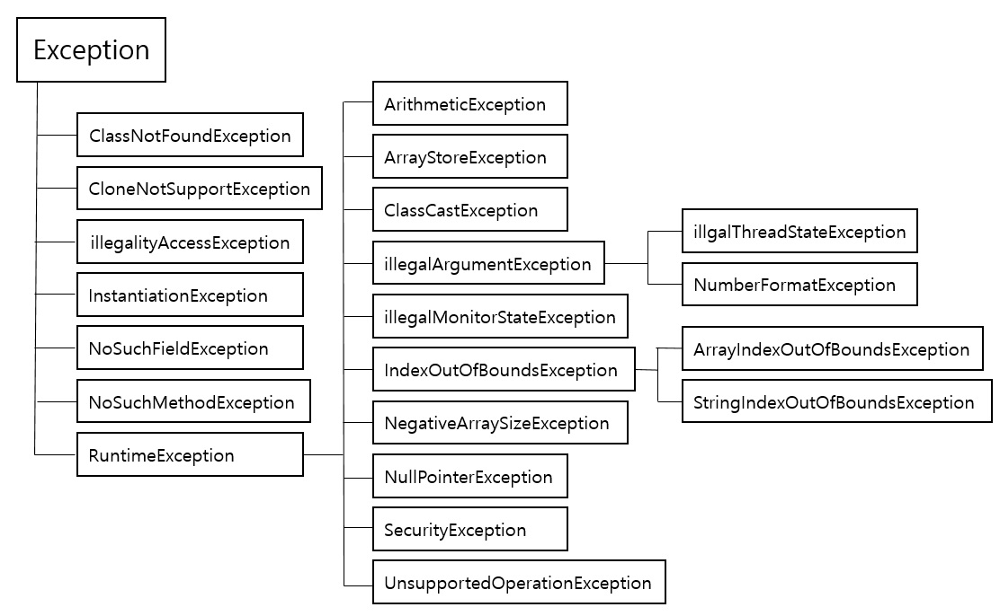

# Error
## Throwable 클래스
- Throwable 클래스는 예외 처리를 할 수 있는 최상위 클래스
- Exception과 Error는 Throwable의 상속을 받는다.


## Error
- 시스템에 예기치 않은 이상 상태가 발생하여 수행 중인 프로그램이 영향을 받는 경우
- 시스템 레벨에서 발생, 개발자가 조치할 수 없는 경우


## Exception
- 시스템에 예기치 않은 이상 상태가 발생하여 수행 중인 프로그램이 영향을 받는 경우
- 개발자가 구현한 로직에서 발생하며, 개발자가 예측하여 방지할 수 있음
- 상황에 맞게 예외처리(Exception Handle) 해야 함.



### Exception의 종류
예외는 Checked Exception, Unchecked Exception 두 개의 종류로 나누어짐

- `Checked Exception` : 예외처리 필수, 처리하지 않으면 컴파일 되지 않음. JVM 외부와 통신(네트워크, 파일시스템 등)할 때 주로 쓰임
    - `RuntimeException` 이외의 모든 예외
    - `IOException`, `SQLException` 등

- `Unchecked Exception` : 컴파일 때 확인되지 않고, Runtime에 발생하는 예외
    - `RuntimeException` 하위의 모든 예외
    - `NullPointerException`, `IndexOutBoundException` 등

### 대표적인 Exception Class
- `NullPointerException` : Null 레퍼런스를 참조할때 발생, 뭔가 동작시킬 때 발생합니다.

- `IndexOutOfBoundsException` : 배열과 유사한 자료구조(문자열, 배열, 자료구조)에서 범위를 벗어난 인덱스 번호 사용으로 발생합니다.

- `FormatException` : 문자열, 숫자, 날짜 변환 시 잘못된 데이터(ex. "123A" -> 123 으로 변환 시)로 발생하며, 보통 사용자의 입력, 외부 데이터 로딩, 결과 데이터의 변환 처리에서 자주 발생합니다.

- `ArthmeticException` : 정수를 0으로 나눌때 발생합니다.

- `ClassCastException` : 변환할 수 없는 타입으로 객체를 변환할 때 발생합니다.

- `IllegalArgumentException` : 잘못된 인자 전달 시 발생합니다.

- `IOException` : 입출력 동작 실패 또는 인터럽트 시 발생합니다.

- `IllegalStateException` : 객체의 상태가 매소드 호출에는 부적절한 경우에 발생합니다.

- `ConcurrentModificationException` : 금지된 곳에서 객체를 동시에 수정하는것이 감지될 경우 발생합니다.

- `UnsupportedOperationException` : 객체가 메소드를 지원하지 않는 경우 발생합니다.


## Exception handler(예외 처리)
Java에서는 모든 예외가 발생하면 ~Exception 객체를 생성합니다.

- 직접 `try ~ catch`를 이용해서 예외를 처리하는 방식 (예외 복구)
```java
final int MAX_RETRY = 100;
public Object someMethod() {
    int maxRetry = MAX_RETRY;
    while(maxRetry > 0) {
        try {
            ...
        } catch(SomeException e) {
            // 로그 출력. 정해진 시간만큼 대기한다.
        } finally {
            // 리소스 반납 및 정리 작업
        }
    }
    // 최대 재시도 횟수를 넘기면 직접 예외를 발생시킨다.
    throw new RetryFailedException();
}
```

- throws Exception을 이용해서 발생한 예외의 책임을 호출 하는 쪽이 책임지도록 하는 방식 (예외 회피)
```java
// 예시 1
public void add() throws SQLException {
    // ...생략
}

// 예시 2 
public void add() throws SQLException {
    try {
        // ... 생략
    } catch(SQLException e) {
        // 로그를 출력하고 다시 날린다!
        throw e;
    }
}
```

- Exception 전환으로 throws Exception와 try ~ catch문을 활용하여 적절한 Exception으로 전환해서 넘기는 방법 (예외 전환)
```java
// 조금 더 명확한 예외로 던진다.
public void add(User user) throws DuplicateUserIdException, SQLException {
    try {
        // ...생략
    } catch(SQLException e) {
        if(e.getErrorCode() == MysqlErrorNumbers.ER_DUP_ENTRY) {
            throw DuplicateUserIdException();
        }
        else throw e;
    }
}

// 예외를 단순하게 포장한다.
public void someMethod() {
    try {
        // ...생략
    }
    catch(NamingException ne) {
        throw new EJBException(ne);
        }
    catch(SQLException se) {
        throw new EJBException(se);
        }
    catch(RemoteException re) {
        throw new EJBException(re);
        }
}
```

## 예상 질문
- Error와 Exception의 차이는 무엇인가?
- 예외 처리하는 방법은 무엇이 있는가?
- Unchecked Exception과 Checked Exception의 차이점은 무엇인가?

### Reference
- [devSquad-study](https://github.com/devSquad-study)