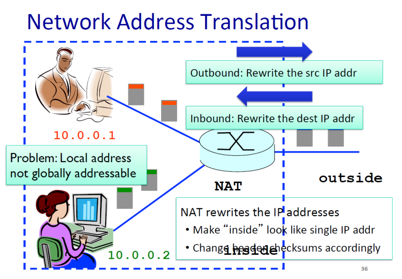
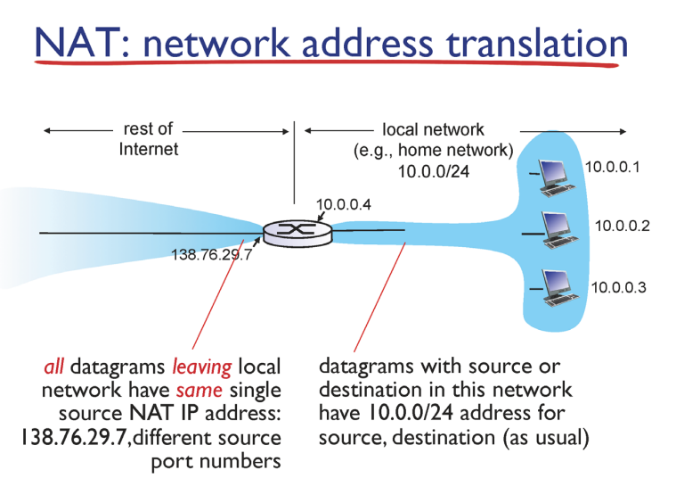
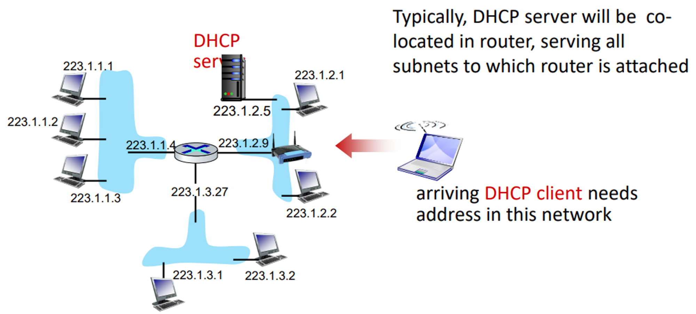
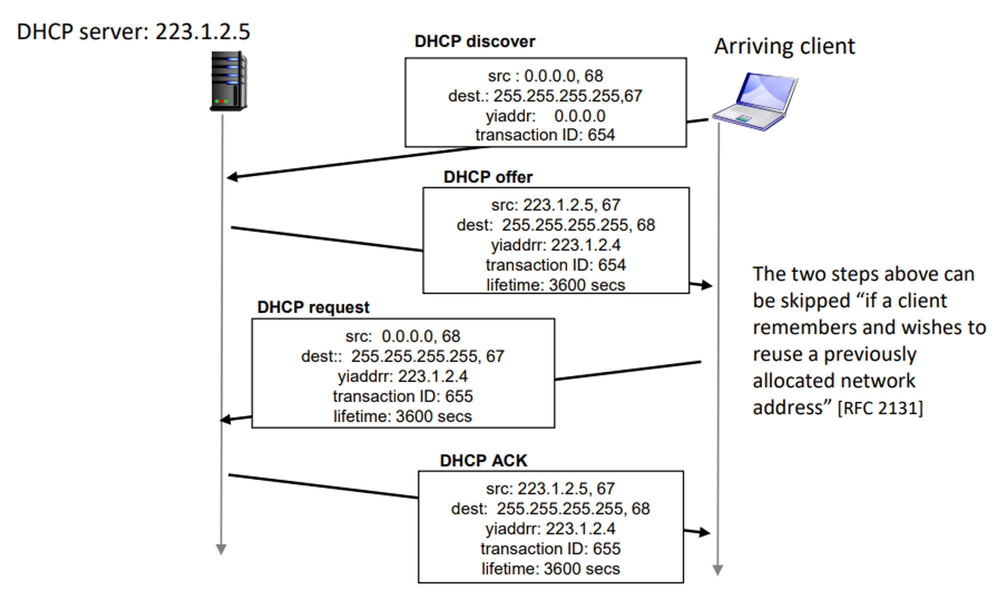
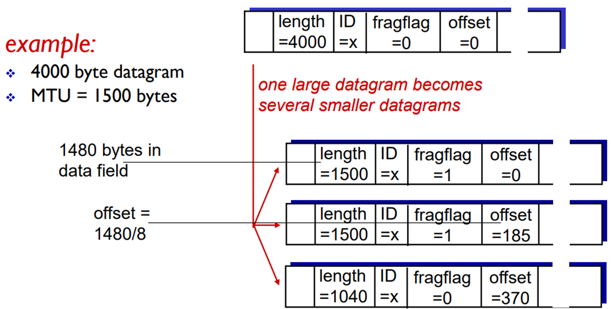

# IPv6

**Why IPv6?**

- IPv4 will be exhausted!! (IPv4가 고갈날 까봐 생김.)
- 2^32 space = 4 billion IP Address

# Network Address Translation(NAT)

### (IPv4 고갈 안 나는 이유)

IP주소 고갈 문제를 해결하는 트릭 같은 것 → 근본적인 해결 방법은 아님

IP주소의 재사용 통해 여러 사람이 같은 주소를 사용함으로써 주소 공간 문제를 해결하는 것

그래서 NAT 방식에서는, 네트워크 내부에서는 유일한 IP 주소를 사용합니다. 그래서 10.0.0.1, 10.0.0.2. 내부에서는 유일합니다. 그러나 내부에서만 유일하기 때문에 또 다른 네트워크의 내부에서 이 IP 주소를 사용할 수 있습니다.

그래서 이러한 IP를 가진 패킷이 외부로 나갈 때는 NAT 기능을 하는 이 게이트웨이 라우터의 IP 주소(전 세계적으로 유일)로 바꿔줍니다. 받는 사람 측에서는 라우터에서 메시지가 온 줄 압니다.

그럼 다시 리턴 패킷을 보낼 때 라우터로 보낼 것 입니다. 그러면 리턴 패킷이 들어올 때는 방금 이 변환 작업을 그대로 반대로 해주게 됩니다. 이게 바로 NAT의 동작 입니다.

게이트웨이 라우터는 NAT를 동작하고 있고, 게이트웨이 라우터에 IP 주소는 여러개 입니다. 왜냐하면 인터페이스 개수만큼 있으니까 IP 주소가 여러 개 있습니다.

그런데 이 그림 같은 경우에는 이 게이트웨이 라우터는 인터페이스가 두 군데고, 각자 IP 주소를 가지며, 서브넷 두 개의 멤버입니다.

그런데 서브넷이라는 건 뭐냐면, 같은 prefix, 같은 네트워크 아이디를 갖는 애들의 집합 입니다. 그럼 결국에는 라우터의 한 인터페이스는 오른쪽 서브넷의 prefix를 가질 수밖에 없죠.

그렇기 때문에 여기 오른쪽에서 10.0.0 이런 prefix를 가진다면, 마찬가지로 이 인터페이스도 10.0.0이라는 prefix를 가지게 됩니다. 그러나 왼쪽 서브넷은 또 주소가 다릅니다.

# Dynamic Host Configuration Protocol(DHCP)

**1. 사전 지식.**

네트워크 환경에 들어가서 IP 주소를 보면, 192.168.1.47. 항상 같이 다니는 서브넷 마스크는 255.255.255.0. 라우터는 192.168.1.1. 그리고 DNS라는 탭이 있습니다. 우리가 인터넷을 하기 위해서 가장 기본적으로 알고 있어야 되는 정보들입니다. 인터넷에 연결되기 위해서는 각자 IP와 서브넷 마스크가 있어야 합니다. 그래서 어디까지가 prefix인지, 네트워크 아이디인지 알려준다고 했는데, 지금 255.255.255.0니까 서브넷의 ID가 192.168.1.0/24 가 됩니다.

**2. 그림과 함께 설명**

외부로 패킷을 보내기 위해서 전달해야 할 라우터의 IP 주소가 "네트워크 세팅"에 적혀있습니다. Destination에 구글 적어서, 라우터한테 보내야 갑니다. 라우터가 없으면 포워딩, 포워딩 테이블, 라우팅도 없게 됩니다. 라우터는 주소를 보면 같은 네트워크에 있습니다. 그리고 같은 네트워크 중에서 보통 첫 번째입니다. (아닌 경우도 있습니다.)

그리고 이 DNS는 우리가 웹 브라우저를 열어가지고 www.naver.com을 검색하면 그때 패킷이 바로 네이버로 가는 게 아니라, 네이버의 IP 주소를 알아야 합니다. 그 IP 주소를 알기 위해서 로컬 네임 서버의 IP 주소가 DNS 탭에 적혀 있습니다. 그런데 DNS 주소는 라우터 주소랑 같습니다. 즉, 로컬 네임 서버 프로세스가 라우터에서 동작하고 있습니다.

Dynamic Host Configuration Protocol(DHCP)에서 가장 중요한 단어는 host configuration 즉, 우리가 노트북 사용할 때 제일 처음에 config하는 그런 일을 해주는 프로토콜 이라는 겁니다. dynamic하게 한다는 얘기는 동적으로 알아서 이런 정보들을 장소마다 다르게 받아와 주는겁니다. 반대로 자신만의 고정된 IP와 라우터를 쓰는 경우도 있습니다. Static IP라고 직접 설정을 하기도 합니다.

> How does host get IP address?
> 
> 
> 1. hard-coded by sysadmin in config file (e.g., /etc/rc.config in UNIX) (직접설정 한다)
> 
> 2. DHCP: Dynamic Host Configuration Protocol: dynamically get address from as server (DHCP가 자동으로 설정해 준다.)
> 
> - “plug-and-play

## 2. DHCP Client-Server Scenario

> goal: host dynamically obtains IP address from network server when it “joins” network (호스트가 빠르게 network에 접글할수 있게 도와준다.)
> 
> - can renew its lease on address in use (사용중이면 알아서 추가 사용 갱신,)
> - allows reuse of addresses (only hold address while connected/on) (이미 사용했던 IP 주소가 있으면 다시 재사용,)
> - support for mobile users who join/leave network(모바일에서 DHCP 자동으로 지원.)

DHCP discover은 broadcast로 DHCP 서버가 있는지 요청 하는 것 입니다. DHCP discover 메시지를 보면 소스 주소는 아직 IP 주소를 할당 받지 못했기 때문에 0.0.0.0 입니다. 그리고 목적지는 IP가 255.255.255.255 이거 32 bit로 봤을 때는 전부 다 1 입니다. 그러니까 모든 address 비트가 1인 경우 broadcast 입니다.

broadcast는 서브넷에 있는 모든 멤버들에게 보내는 것 입니다. DHCP 서버는 포트 넘버는 67번 입니다. 그리고 transaction ID는 offer와 request를 위해서 ip 대신으로 우리를 특정하기 위해 랜덤하게 부여받는 번호입니다. 그러면 이 DHCP discover 메시지를 이 서브넷에 있는 모든 멤버들이 받습니다.

그런데 이 DHCP discover 메시지를 이 서브넷에 존재하는 모든 호스트들이 받지만, DHCP 서버만 받아들이고 나머지는 드랍하게 됩니다. 왜냐하면 67번 포트를 향해서 메시지가 보내지는데, DHCP 서버가 돌고 있는 멤버만 67번 포트를 열어서 listen하고, 나머지는 포트를 열지 않고 서버를 돌리지 않고 있기 때문입니다. 그래서 중간에 67번 포트가 없어서 드랍됩니다.

그래서 67번 포트를 열고 기다리고 있는 DHCP 서버만 이 discover 메시지를 받아서 offer를 줍니다. offer 메시지에 source IP와 포트 넘버는 서버 자신 이고, destination은 broadcast 입니다. 왜냐하면 아직 우리는 IP를 할당 받지 않았기 때문에 broadcast를 하고, transaction ID와 68번 포트가 열려있는 것으로 우리를 특정짓게 됩니다.

offer에 담긴 의미는 앞으로 너는 내가 부여한 새로운 주소를 지금부터 1시간 동안 사용을 할 수 있다는 offer를 주는 겁니다. 그럼 우리는 이 offer를 받아서, 이 offer가 마음에 들면 offer를 수락합니다. 수락한다는 의미로 다시 이 offer에 대한 request를 보내야 합니다.

이 offer에 대한 request 보낼 때, 소스는 아직 이름이 없습니다. 왜냐면 아직까지 이 IP도 확정된 게 아니기 때문입니다. 그래서 소스 주소는 0.0.0.0이고, 보내준 IP를 사용하고 싶다는 의미로 아까의 transaction ID에서 하나 플러스 1 시켜서 request의 의미로 보내게 됩니다. 그래서 이게 응답이 오면 우리는 이제부터 이 IP 주소를 우리의 IP로 사용하게 되고 통신이 가능해 집니다. offer에는 부여할 IP 주소뿐만 아니라, 라우터 IP, DNS IP도 들어 있습니다.

offer만 받아도 될 것 같은데 offer에 request하는 이유가 있습니다. discover 메시지는 "도와주세요." 라고 요청한 것입니다. 그런데 보통의 경우는 서브넷 안에 DHCP 서버가 한 개 있지만, 어떤 경우는 서버가 여러 개 있을 수도 있습니다. 만약 서버가 두 개면 각각 두개의 offer가 옵니다. 그 후 offer들 중에 한개를 선택하게 됩니다.

discover 메시지의 destination이 다 255.255.255.255인 것에 대해서 추가 설명하자면 여기 DHCP request의 destination도 broadcast 입니다. destination에다가 offer를 보낸 DHCP 서버 주소 쓰면 안 되는 이유는 내부에 DHCP 기능을 하는 서버가 여러 개 있을 수가 있어서 우리한테 준 offer가 선택이 안 됐다는 걸 간접적으로 알려주기 위해서 저렇게 하는 것 입니다.

# IP Fragmentation & Reassembly

각 링크별로 링크가 한꺼번에 한 번에 보낼 수 있는 그 데이터 유닛의 맥시멈 사이즈가 정해져 있습니다. 그걸 우리가 MTU, maximum transfer unit이라고 불리는데 이 MTU는 링크 레이어 기술마다 다 다릅니다. 예를 들어 인터넷, 와이파이, 3g 아니면 옵틱, 광 케이블 이런 애들이 다 링크이고 MTU가 다 다릅니다.

MTU의 예를 들면 4000바이트짜리 패킷을 sender가 보냈는데, 특정 링크에서 처리할 수 있는 maximum transfer unit이 예를 들면 1500 바이트라면 보내지지 않습니다. 문제 해결을 위해 현재 인터넷 버전 IPv4에서는 처리할 수 있는 MTU보다 더 큰 사이즈의 패킷이 들어오게 되면 거기서 바로 분리합니다.

MTU 사이즈에 맞는 독립적인 사이즈의 프레임으로 바뀌어서 진행이 됩니다. 그래서 얘네들은 각자 이제 서로 다른 패킷이 되고 마지막에 합체해서 다시 원래 패킷으로 돌아옵니다. 이런 fragmentation, assembly 작업을 위해서 필요한 것들이 ID, flag, offset 입니다.

Sender가 IP 패킷을 생성해서 헤더가 있고 데이터가 있습니다. 위 그림은 헤더 필드 중에 하나가 4000 바이트짜리인 패킷 length 입니다. ID는 패킷별로 안겹치게 sender가 정하게 됩니다.

이 패킷이 사이즈는 4000, ID는 x이고 숫자 입니다. 그리고 이 flag는 첫번째 fragment 뒤로 추가 fragment 오는지 의미합니다. flag가 처음 만들어졌을 때는 fragment가 안 된 거니까 0 입니다. 그리고 마지막 fragement는 fragment가 끝난 것 이니까 0 입니다.

예를 들어 이 4천 바이트짜리 패킷이 MTU 1500인 링크를 만났다고 가정하겠습니다. 이 4000 바이트는 헤더와 데이터를 포함한 전체를 의미 합니다. 헤더 크기가 20바이트 입니다. 그러면 실제적으로 데이터는 3980바이트 이므로 링크의 MTU 1500 보다 크므로 나눠져야 합니다.

그리고 offset은 만약에 fragment 된 경우에 첫 번째 시작 부분이 전체 패킷에서 어느 정도의 위치를 차지하는지를 나타냅니다. 즉, offset은 두번째 fragement는 원래 기존의 데이터에서 잘려져서 시작할 것 인데 잘린 부분이 어디인지를 의미합니다. 아래의 그림에서 추가설명을 하겠습니다.

첫 번째 fragment 보면, length는 1500으로 MTU 사이즈에 맞게 첫 번째가 나오고 ID는 x 입니다. flag는 1로 바뀝니다. 내 뒤에 fragment 된 게 있다는 것 입니다. 그리고 나의 offset은 나는 제일 앞이니까 0이 됩니다.

그리고 두번 째 fragment가 또 다른 패킷으로 딱 변하고, length: 1500, ID = x, flag = 1 입니다. offset은 원래 데이터 사이즈는 3980 바이트 였는데, 쪼개가지고 첫 번째 fragment에 1480바이트 들어갔습니다. 다음 fragment도 1480 바이트 들어갔죠. 그러니까 1480을 적으면 되는데, 필드 비트 수 줄이기 위해 8을 나눠서 적어줍니다. 그래서 3비트가 줄게 됩니다.

Fragment의 이러한 정보로 나중에 병합이 가능합니다. 그러니까 이게 어떤 방식으로 분리를 했는지 기록해놓는 것 입니다. 추가로 만약에 분리돼서 독립적인 패킷이 되서 가는데 중간에 하나가 없어지면 reassembly(재결합)이 안됩니다. 예를 들면 첫 번째랑 세 번째는 갔는데 두 번째가 사라진 경우 입니다. reassembly(재결합)가 안 되면 패킷이 완성이 안 됐으니까, 위로 못 올립니다. 그런데 reassembly가 안 되니까, 없는 패킷이 됩니다. 그래서 나중에 TCP에서 타이머 터지고, 위에서 알아서 재전송을 합니다.