# 06_Process Syncronization

# 📌 Process Syncronization (프로세스 동기화)

- Concurrency Control (병행 제어) 라고도 함
- 프로세스가 동시에 실행될 때 control 하는 것

- 한 개의 스토리지 박스를 여러 Execution이 공유한다면 원치 않는 결과를 초래할 수 있음
- `Race condition` : 경쟁 상태

## OS에서 race condition은 언제 발생하는가?

### 1. kernel 수행 중 인터럽트 발생 시

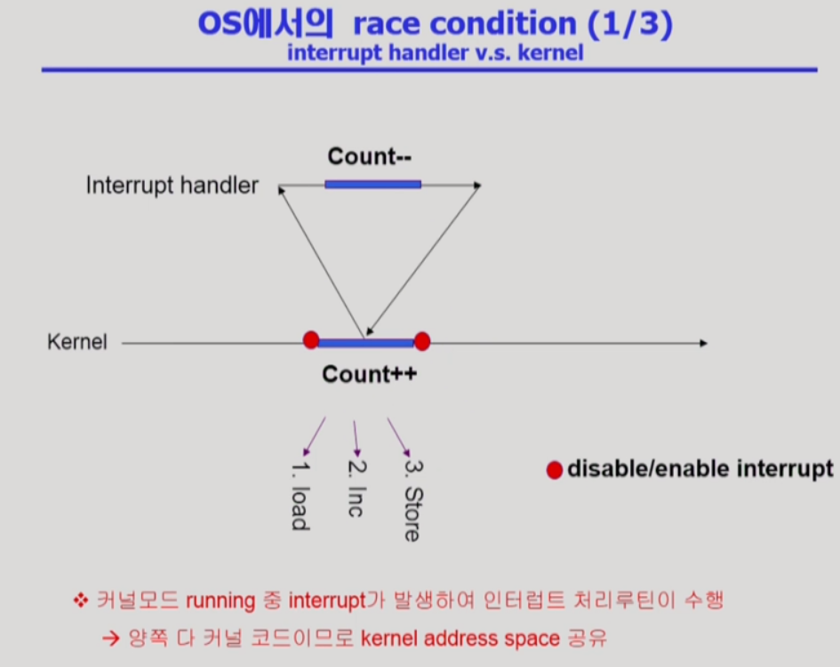

- kernel 작업 중 Interrupt 가 들어오면 실행됨
- 양쪽 다 커널 코드이므로 kernel address space 공유
- 결과적으로는 1 증가한 값만 반영됨

→ 이러한 문제 해결하기 위해 Interrupt를 받아들이지 않는 방법 사용

### 2. Process가 system call을 하여 kernel mode로 수행 중인데 context switch가 일어나는 경우

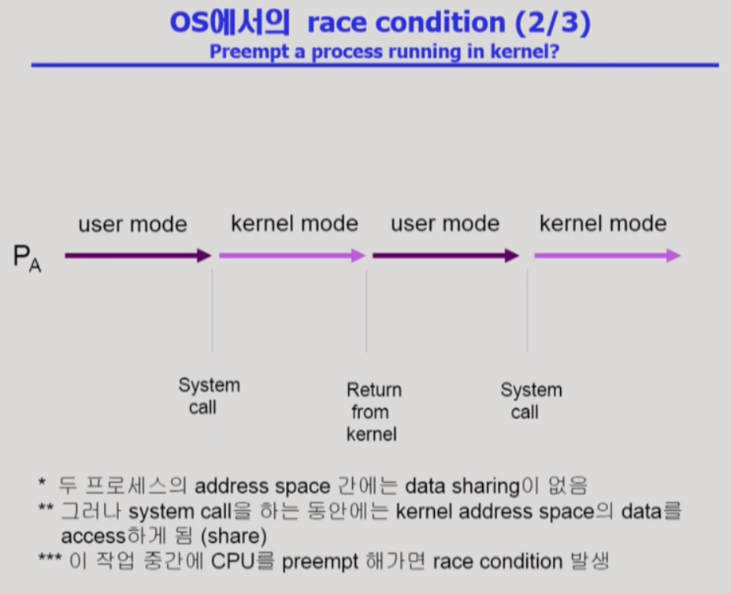

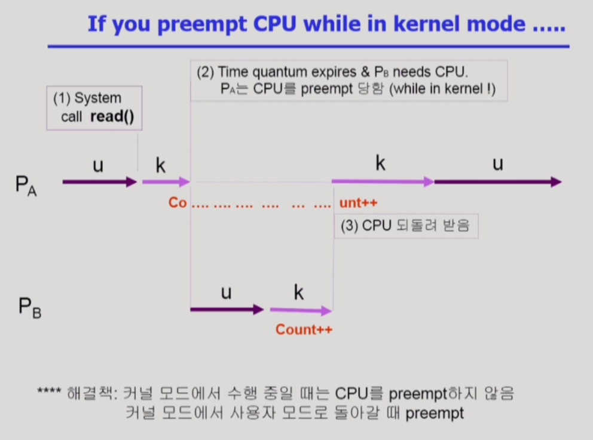

- `해결책` : 프로세스가 커널 모드에 있을 떄는 할당 시간이 끝나도 CPU를 뺏지 않는 것
- User mode로 빠져 나올 때 CPU를 뺏어옴

### 3. Multiprocessor에서 shared memory 내의 kernel data

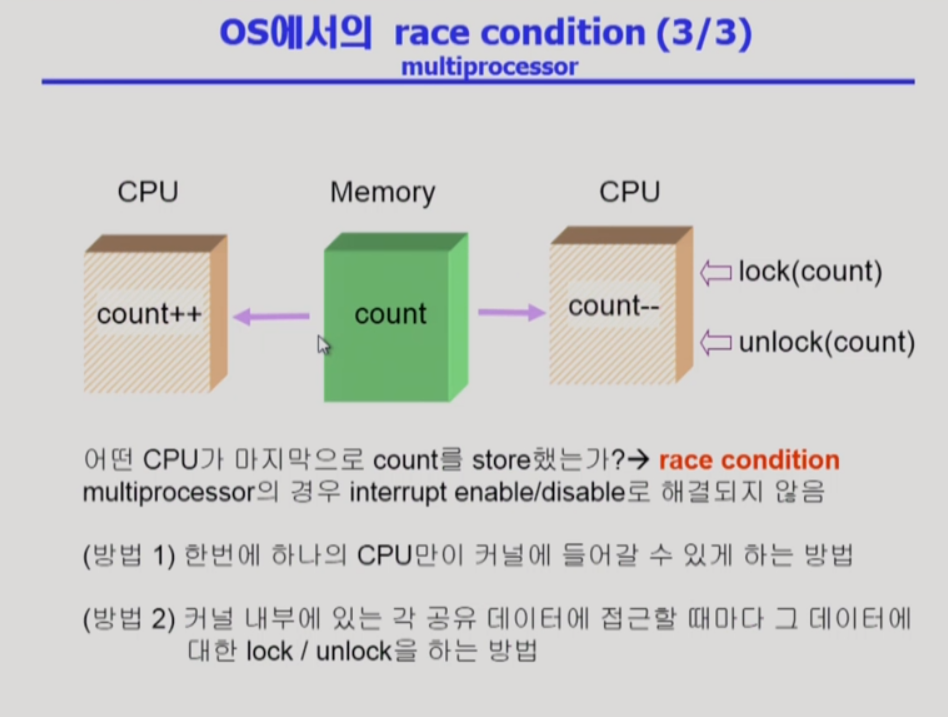

- CPU가 여러개 있는 환경에서는 데이터에 접근할 때 lock을 걸어야 함(데이터에 접근하지 못하도록)

### Process Synchronization 문제점

- 프로세스 간 shared memory를 쓰거나 같은 kernel에 있는 데이터를 사용하여 CPU가 넘어간다던지 할 때 문제가 생기는거지, 단순히 프로세스가 P1에서 P2로 넘어간다고 문제가 생기진 않음
- 보통 프로세스는 자신만의 독자적인 주소공간에 있는 데이터를 취급하기 때문

### The Critical-Section Problem

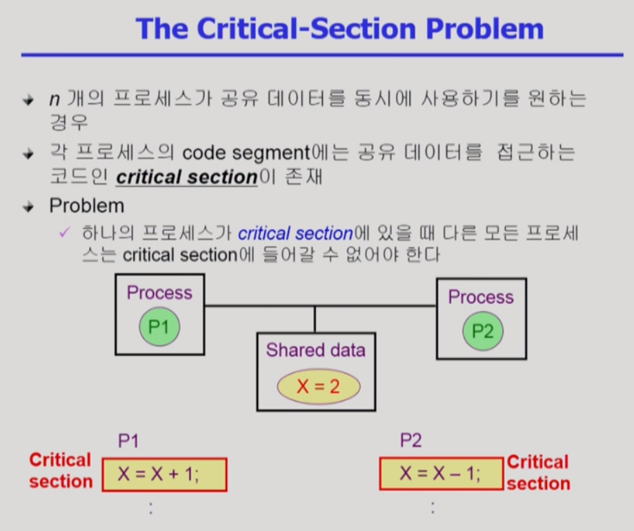

- `Critical-Section` : 공유 데이터를 접근하는 코드

프로세스가 공유 데이터 접근하는 코드를 실행 중이면 CPU가 넘어가더라도 공유 데이터 접근을 불가 하도록 하고, 

Critical-Section에서 빠져 나왔을 땐 접근 가능하도록 해야 함

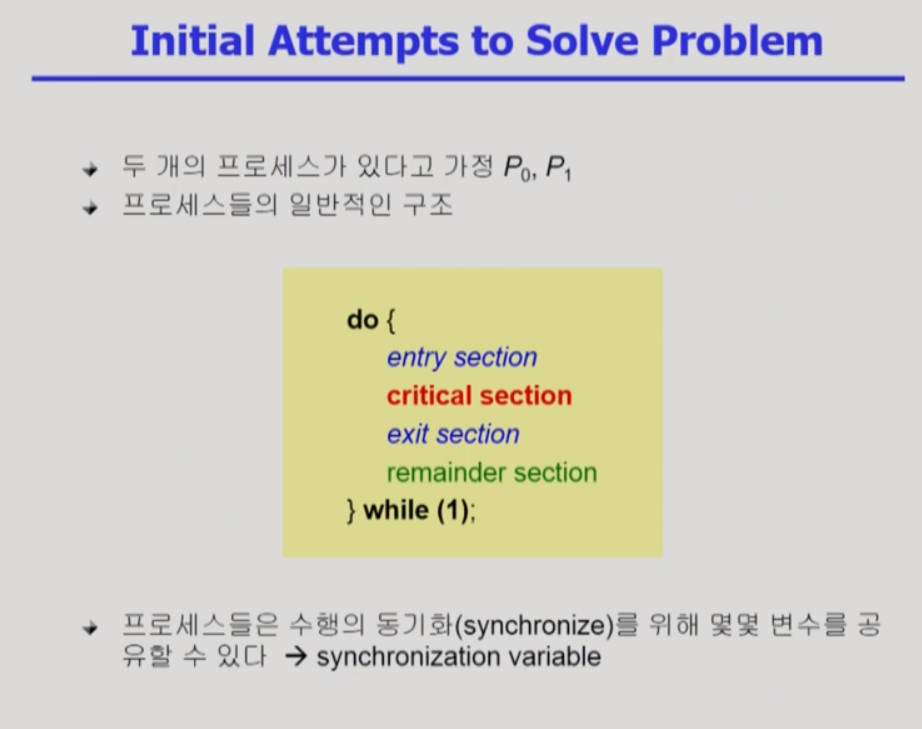

- `entry section` : 여러 프로세스가 동시에 공유데이터 접근 막도록 lock
- `critical section` : 공유데이터 접근하는 부분
- `exit section` : lock을 풀어서 다른 프로세스가 접근할 수 있도록 함
- `remainder section` : 공유데이터 접근하지 않는 부분

### 프로그램적 해결법의 충족 조건

- `Mutual Exclusion(상호 배제)` : 어떤 프로세스가 critical section을 수행 중이면 다른 모든 프로세스들은 접근할 수 없다.
- `Progress(진행)` : critical section에 아무 것도 들어있지 않은 상태면 critical section에 접근 가능해야 한다.
- `Bounded Waiting(유한 대기)` : Starvation 방지

- turn = 0? 0번 프로세스 차례
- turn = 1? 1번 프로세스 차례
- `Mutual Exclusion` 만족
- `Progrss` 불만족 → 반드시 한 번씩 교대로만 들어가야 함. 아무도 critical section에 없을 때에도 실행이 안 됨

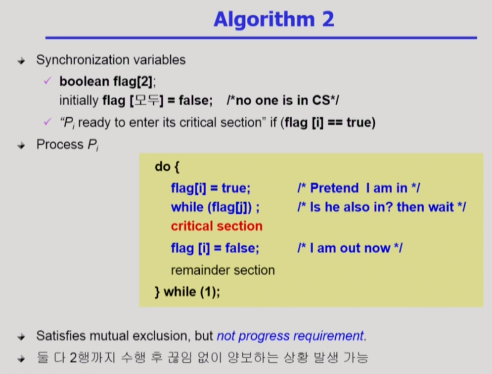

- critical section 입장 전 본인 flag 세팅 → 이 과정에서 이미 프로세스 뺏긴 상태
- 상대방이 flag 들었다면, 둘 다 flag만 든 상태로 아무도 critical section에 들어가지 못하는 문제점 발생

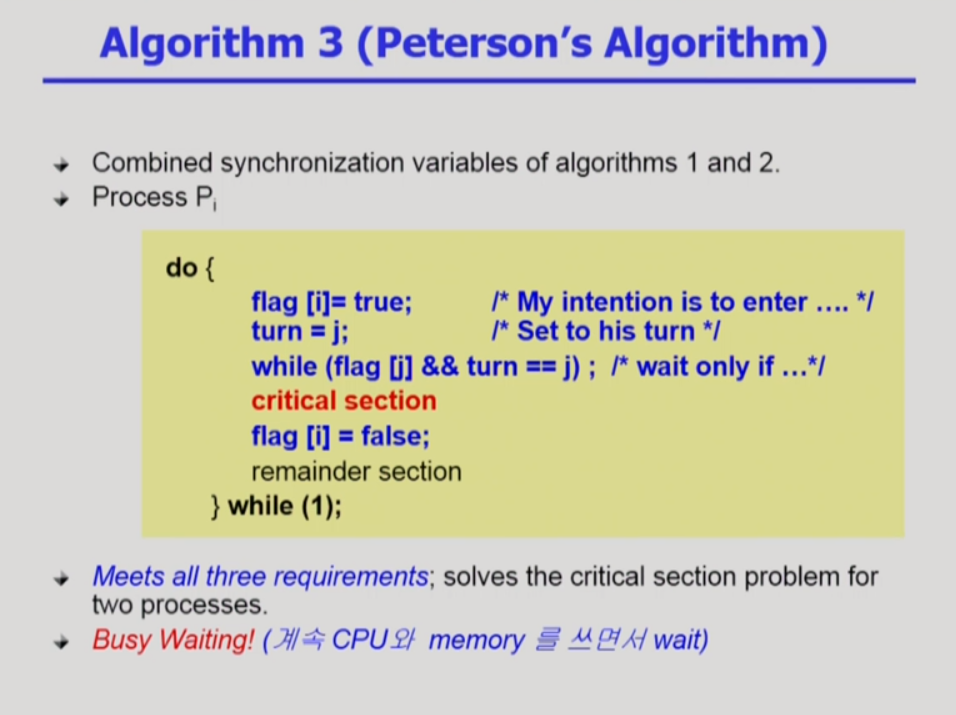

- turn과 flag 방식 모두 사용
- Mutual Exclusion, Progress, Bounded Waiting 세 가지 조건 모두 충족
- Busy Waiting 문제점 (=spin lock) : 본인의 CPU 할당 시간 동안 while문 돌기만 하게 되는 비효율적인 경우

### 하드웨어적으로 해결 할 수 있을까?

- 하드웨어적으로 Test and set을 통해 조금 더 간결하게 해결할 수 있다.

## 추상자료형 Semaphores

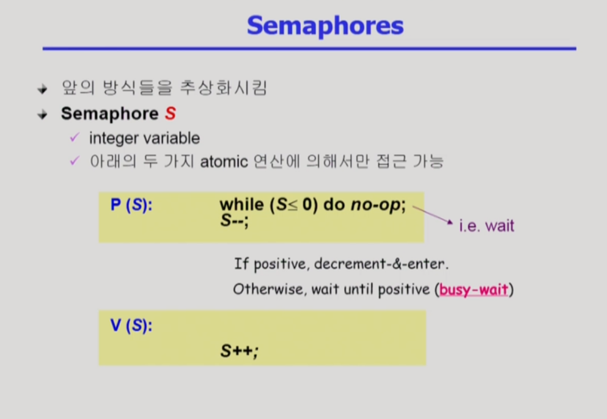

- `P 연산` : 공유데이터(자원) 획득하는 연산 (lock하는)
- `V 연산` : 공유데이터(자원) 반납하는 연산 (lock푸는)
- atomic하게 이루어져야 함

- 프로그래머는 Semaphore가 지원이 된다면, P 연산과 V 연산을 통해 간단하게 제어할 수 있다.
- Busy Waiting에는 효율적이지 못함

## Block/Wakeup Implementation

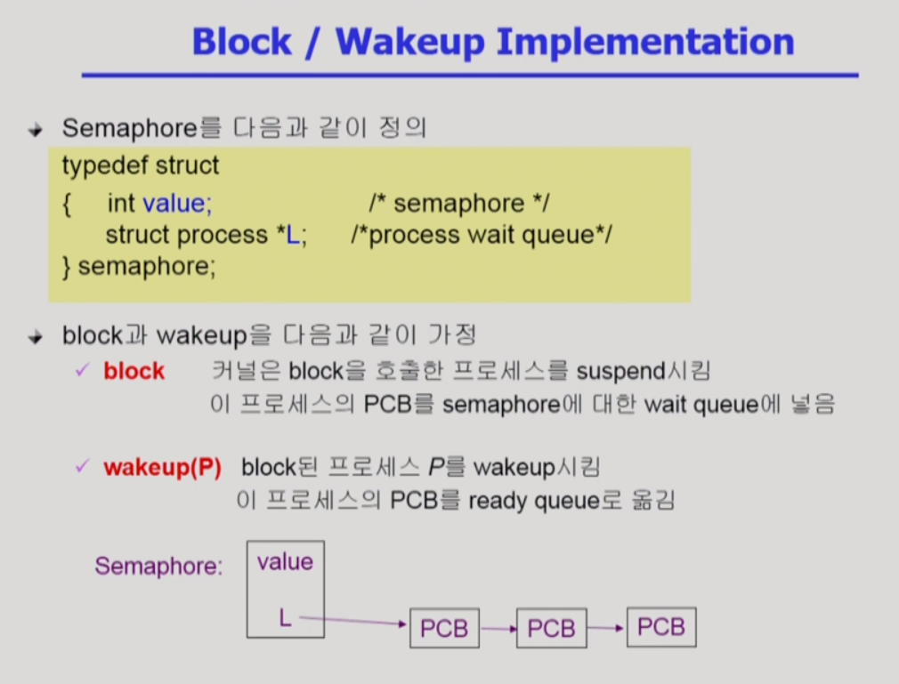

- Semaphore를 기다리는 process의 PCB를 wait queue에 넣음

- P 연산 : 값을 빼주는데, 음수일 경우 block을 하고 waiting queue에 추가
- V 연산 : 자원을 내놓았는데도 불구하고 0 이하이면, 잠들어있는 process를 Semaphore에서 꺼냄

## Busy-wait vs Block/wakeup 비교

- Block/wakeup overhead vs Critical section 길이
    - Critical section의 길이가 긴 경우 Block/wakeup이 적당
    - Critical section의 길이가 매우 짧은 경우 Block/wakeup 오버헤드가 busy-wait 오버헤드보다 더 커질 수 있음
    - 일반적으로는 Block/wakeup 방식이 더 좋음

## Two types of Semaphores

- `Counting semaphore`
    - 도메인이 0 이상인 임의의 정수 값
    - 주로 resource counting에 사용
- `Binary semaphore (=mutex)`
    - 0 또는 1 값만 가질 수 있는 semaphore
    - 주로 mutual exclusion (lock/unlock)에 사용

### Deadlock and Starvation

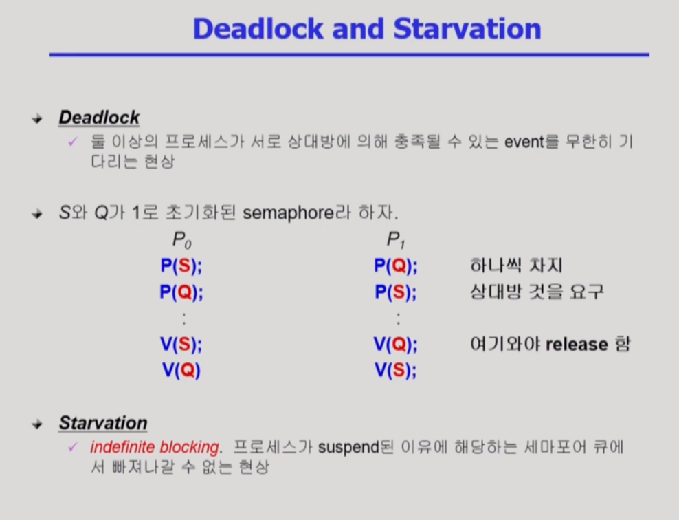

- `Deadlock` : 서로 하나씩 차지하고 상대방 것을 요구하기 때문에 서로 상대방에 의해 충족될 수 있는 event를 무한히 기다리는 현상이 발생할 수 있음

# 📌 Classical Problems of Synchronization

## 1. Bounded-Buffer Problem

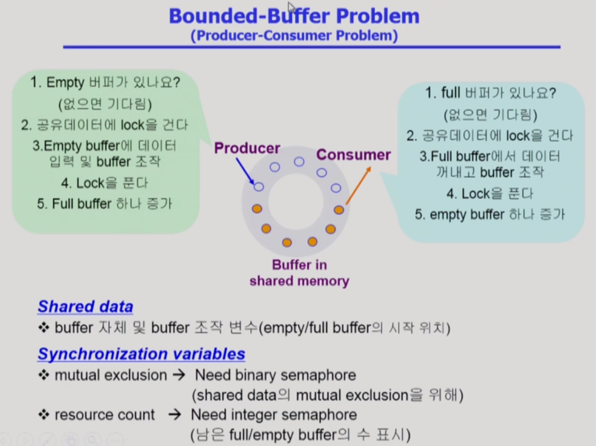

- 공유데이터는 buffer 자체
- mutual exclusion : lock을 걸고 푸는 용도로 semaphore 변수 필요
- resource count : 남은 full/empty buffer 수 표시

## 2. Readers-Writers Problem

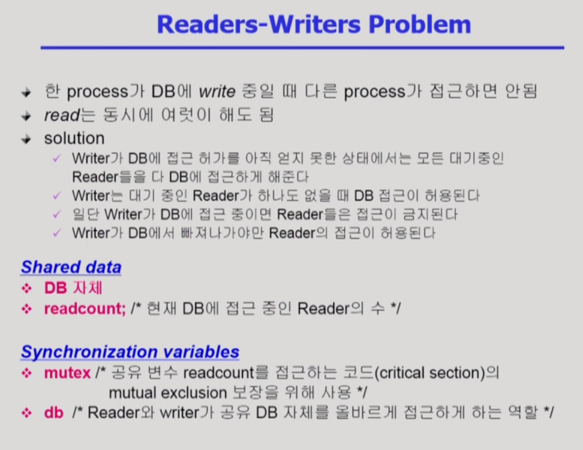

- 한 process가 DB에 write 중일 때 다른 process가 접근하면 안됨
- read는 동시에 여럿이 해도 됨
- solution
    - Writer가 DB에 접근 허가를 아직 얻지 못한 상태에서는 모든 대기중인 Reader들을 다 DB에 접근하게 해준다.
    - Writer는 대기 중인 Reader가 하나도 없을 때 DB 접근이 허용된다
    - 일단 Writer가 DB에 접근 중이면 Reader들은 접근이 금지된다
    - Writer가 DB에서 빠져나가야만 Reader의 접근이 허용된다

- 읽을 때도 lock은 걸어 놓지만, 여러 사람이 동시에 read는 할 수 있음
- readcount 변수는 공유 변수이기 때문에, 바꿀 때도 lock이 필요함
- writer는 마지막 reader가 다 읽고 빠져나가면서 lock을 풀어줄 때까지 write할 수 없는 문제점 발생

### 3. Dining-Philosophers Problem

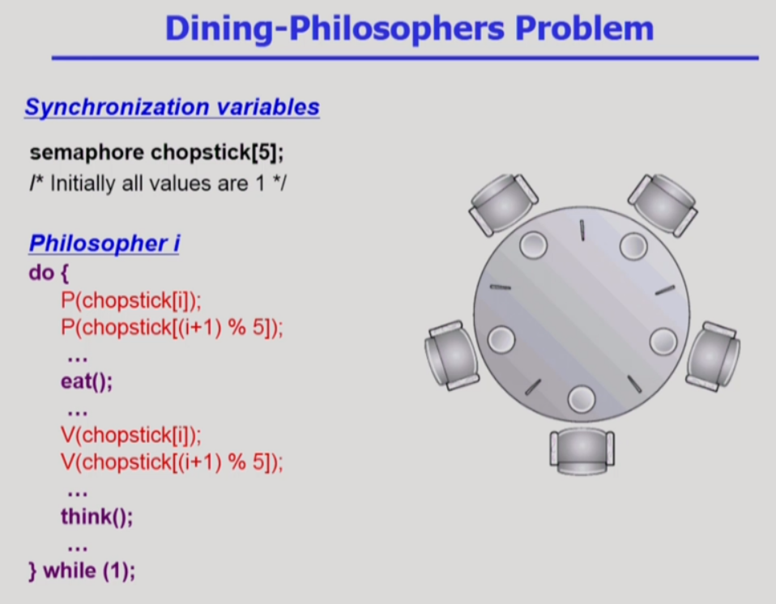

- 문제점
    - Deadlock 가능성이 있음
    - 모든 철학자가 동시에 배가 고파져 왼쪽 젓가락을 집어버린 경우
    - 아무도 오른쪽 젓가락을 집을 수 없음
- 해결방안
    - 4명의 철학자만이 테이블에 동시에 앉을 수 있도록 한다.
    - 젓가락을 두 개 모두 집을 수 있을 때에만 젓가락을 집을 수 있게 한다.
    - 비대칭
        - 짝수(홀수) 철학자는 왼쪽(오른쪽) 젓가락부터 집도록 함

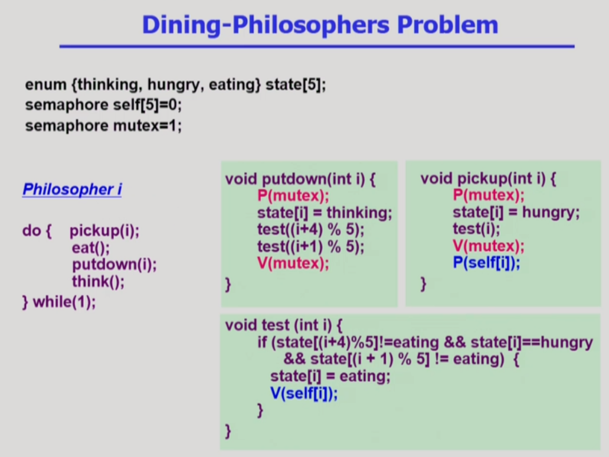

- state[x] : 철학자의 상태
- self[x] : 젓가락 두 쪽을 모두 집을 수 있는 상태인지
- mutex : lock을 나타냄

## Monitor

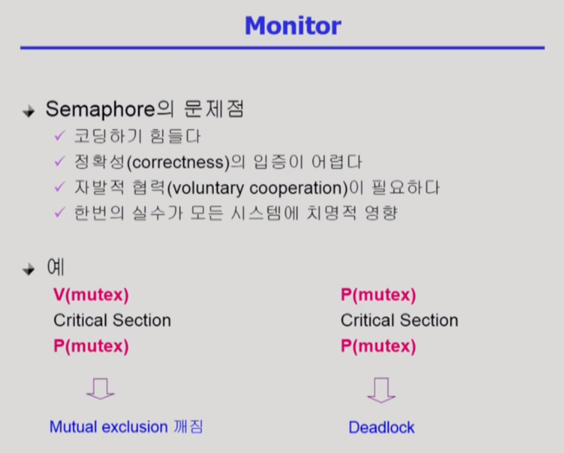

- P 연산 → Critical Section → V 연산 순서대로 진행되어야 함
- 실수로 순서를 뒤바꾸거나, 두 번 진행하려고 하면 문제가 발생 함

→ 그래서 Monitor 가 필요함

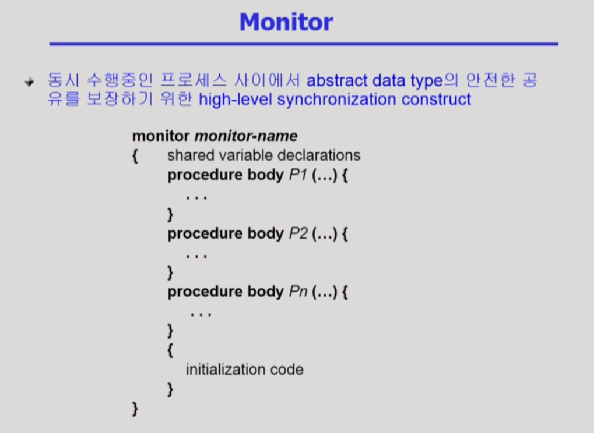

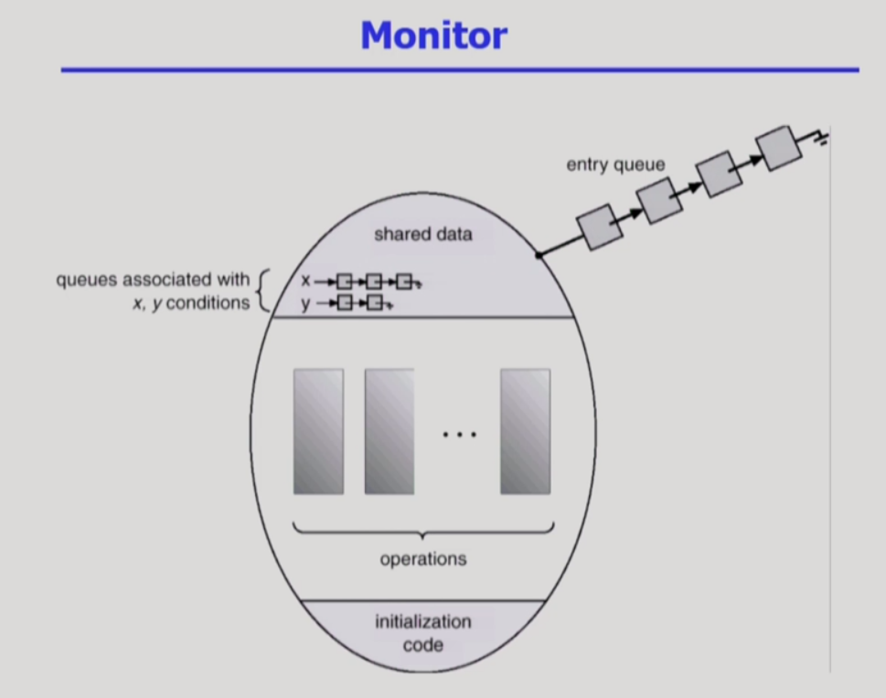

- Semaphore는 프로그래머가 작업 시작 전/후로 lock을 걸어줘야 함
- monitor는 lock 걸 필요 없이 공유 데이터와 연관된 내부 프로시저에만 접근 할 수 있도록 함
    - 동시에 접근할 수 없도록 동시에 모니터가 통제함
    - 나머지는 queue를 통해 줄서서 기다림

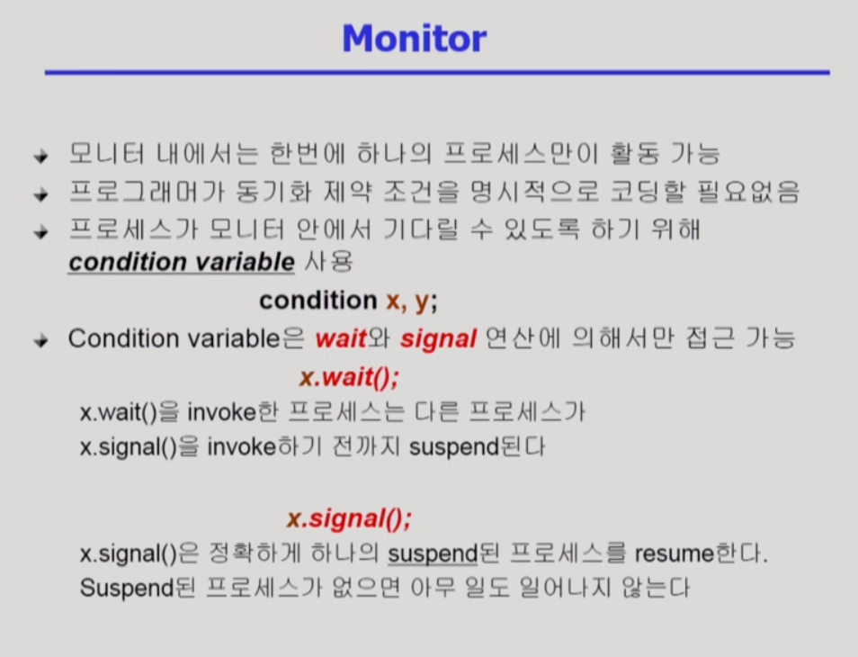

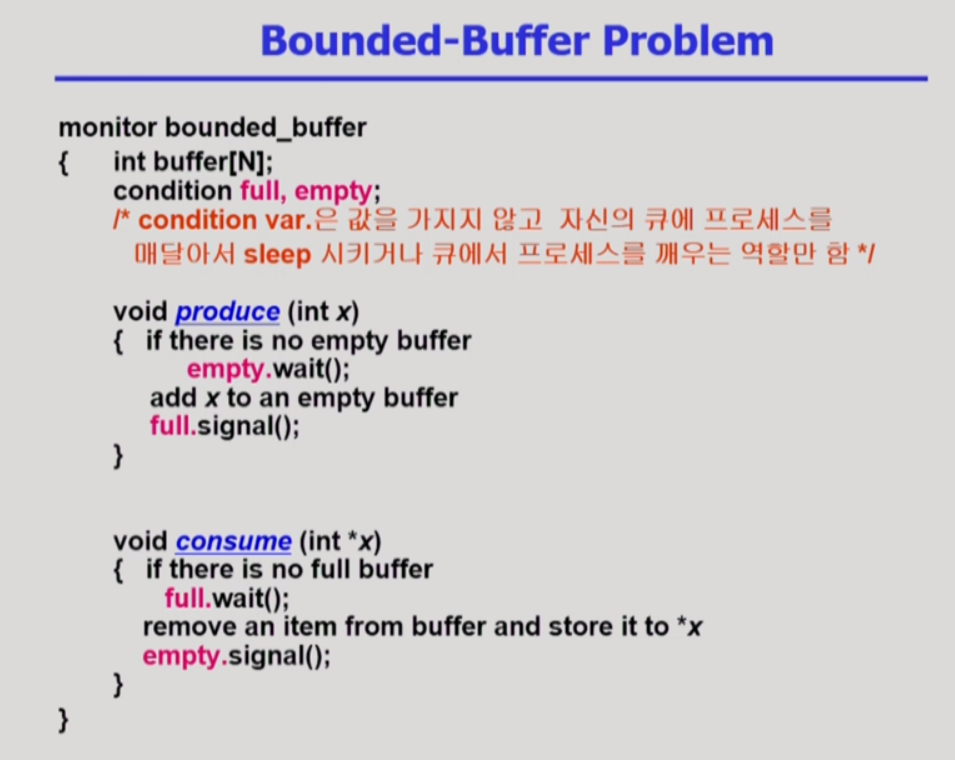

- 공유buffer가 모니터 안에 정의되어 있기 때문에 모니터 내부 코드를 실행하므로
- 하나의 프로세스만 모니터 안에서 활성화되므로 lock이 굳이 필요하지 않음
- monitor를 사용하면 Semaphore 보다 프로그램 이해가 쉽고, lock을 걸 필요가 없다는 장점이 있음